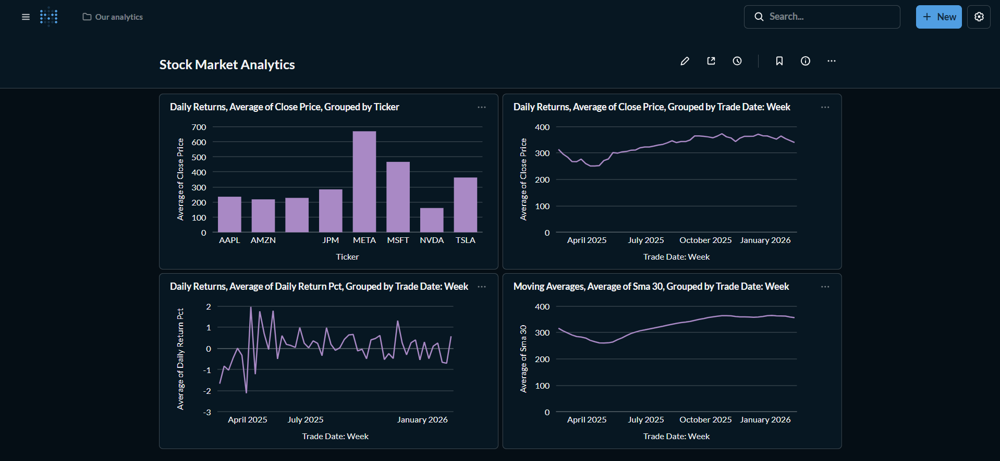

# 📈 Stock Market Data Pipeline

End-to-end batch data pipeline that ingests real stock market data, transforms it through a multi-layer warehouse, and serves analytics via a BI dashboard — fully orchestrated and containerized.

## Dashboard


## Architecture
```
yfinance API → Python Ingestor → Parquet Files → DuckDB Warehouse → Metabase Dashboard
                                                      ↑
                                                 Airflow DAG
                                                 (orchestrates)
                                                      ↑
                                                 dbt Models
                                             (raw → staging → marts)
```

## Tech Stack
| Layer | Tool |
|---|---|
| Ingestion | Python + yfinance |
| File Format | Apache Parquet |
| Orchestration | Apache Airflow |
| Warehouse | DuckDB |
| Transformation | dbt Core |
| Visualization | Metabase |
| Containers | Docker Compose |

## Pipeline Layers
- **Raw** — Parquet files loaded as-is into DuckDB
- **Staging** — Cleaned, typed, deduplicated via dbt
- **Marts** — Daily returns, volatility, moving averages (SMA7/30/90)

## Quick Start
```bash
# Start all services
docker-compose up -d

# Run ingestion
python ingestion/fetch_stocks.py
python ingestion/load_to_duckdb.py

# Run dbt
cd dbt_project
dbt run --profiles-dir .
dbt test --profiles-dir .
```

## Data Quality
20 automated dbt tests covering uniqueness, not-null checks, accepted values and custom SQL tests.

## Tickers Tracked
AAPL, MSFT, GOOGL, AMZN, META, TSLA, NVDA, JPM